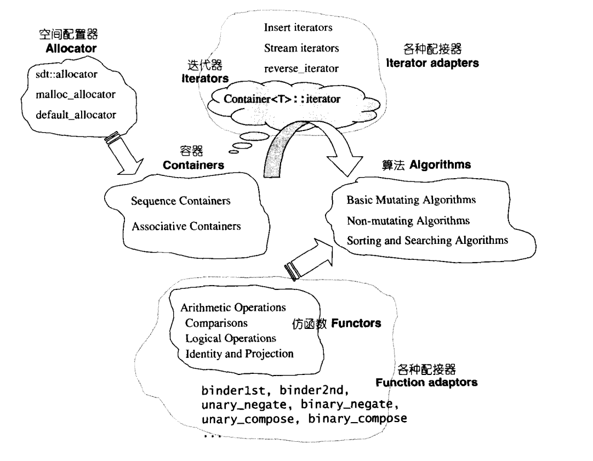

# STL traits

Containers -> Iterators (Iterator adapters) -> Algorithms

图片出自：[CPlusPlusThings](https://github.com/Light-City/CPlusPlusThings/blob/master/src_analysis/stl/traits.md)

- [std::iterator_traits](https://en.cppreference.com/w/cpp/iterator/iterator_traits)：作为统一的迭代接口，被容器用于各自的实现

- [iterator_tags](https://en.cppreference.com/w/cpp/iterator/iterator_tags)：仅作为标记（结构体继承的方式）标记不同类别的容器
