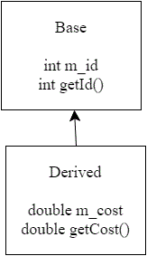
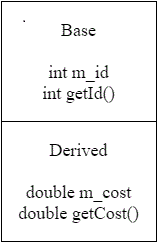

# Order of construction of derived classes

```cpp
class Base
{
public:
    int m_id {};

    Base(int id=0)
        : m_id { id }
    {
    }

    int getId() const { return m_id; }
};

class Derived: public Base
{
public:
    double m_cost {};

    Derived(double cost=0.0)
        : m_cost { cost }
    {
    }

    double getCost() const { return m_cost; }
};
```

这个例子中 `Derived` 由 `Base` 中派生出来。



因为 `Derived` 从 `Base` 中继承了函数与变量，也许可能会认为 `Base` 的成员被拷贝到了 `Derived`。然而这并不正确。相反的是 `Derived` 被视为两部分的类：一部分是 `Derived`，另一部分是 `Base`。



当 C++ 构造派生对象时，会：首先最开始的类（即继承树最顶层）被构造，接着每个子类按照顺序依次构造，直到最底层的类（继承树的最底层）被构造。

```cpp
#include <iostream>

class Base
{
public:
    int m_id {};

    Base(int id=0)
        : m_id { id }
    {
        std::cout << "Base\n";
    }

    int getId() const { return m_id; }
};

class Derived: public Base
{
public:
    double m_cost {};

    Derived(double cost=0.0)
        : m_cost { cost }
    {
        std::cout << "Derived\n";
    }

    double getCost() const { return m_cost; }
};

int main()
{
    std::cout << "Instantiating Base\n";
    Base base;

    std::cout << "Instantiating Derived\n";
    Derived derived;

    return 0;
}
```

打印：

```txt
Instantiating Base
Base
Instantiating Derived
Base
Derived
```

## 继承链的构造顺序

```cpp
#include <iostream>

class A
{
public:
    A()
    {
        std::cout << "A\n";
    }
};

class B: public A
{
public:
    B()
    {
        std::cout << "B\n";
    }
};

class C: public B
{
public:
    C()
    {
        std::cout << "C\n";
    }
};

class D: public C
{
public:
    D()
    {
        std::cout << "D\n";
    }
};

int main()
{
    std::cout << "Constructing A: \n";
    A a;

    std::cout << "Constructing B: \n";
    B b;

    std::cout << "Constructing C: \n";
    C c;

    std::cout << "Constructing D: \n";
    D d;
}
```

记住 C++ 总是最先构建”最初“或者”最基础“的类。接着通过继承树的顺序来构造每个派生类。打印：

```txt
Constructing A:
A
Constructing B:
A
B
Constructing C:
A
B
C
Constructing D:
A
B
C
D
```
