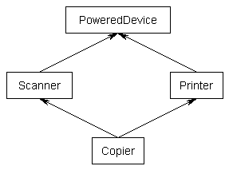

# Virtual base classes

17.9 章节中提到了继承中的“菱形问题”，这章节将恢复这个问题的讨论。

```cpp
#include <iostream>

class PoweredDevice
{
public:
    PoweredDevice(int power)
    {
    std::cout << "PoweredDevice: " << power << '\n';
    }
};

class Scanner: public PoweredDevice
{
public:
    Scanner(int scanner, int power)
        : PoweredDevice{ power }
    {
    std::cout << "Scanner: " << scanner << '\n';
    }
};

class Printer: public PoweredDevice
{
public:
    Printer(int printer, int power)
        : PoweredDevice{ power }
    {
    std::cout << "Printer: " << printer << '\n';
    }
};

class Copier: public Scanner, public Printer
{
public:
    Copier(int scanner, int printer, int power)
        : Scanner{ scanner, power }, Printer{ printer, power }
    {
    }
};
```

尽管预期继承的图像是这样：



如果创建了一个 `Copier` 类的对象，默认会得到两份 `PoweredDevice` 类 -- 一个给 `Printer`，另一个给 `Scanner`。


```cpp
int main()
{
    Copier copier{ 1, 2, 3 };

    return 0;
}
```

打印：

```cpp
PoweredDevice: 3
Scanner: 1
PoweredDevice: 3
Printer: 2
```

可以看到，`PoweredDevice` 被构造了两次。

虽然以上是经常需要的，但是其它时候可以只有一个副本的 `PoweredDevice` 被 `Printer` 与 `Scanner` 共享。

## 虚基类

为了共享一个基类，只需要简单的在派生类的继承列表前加上“virtual”关键字即可。这样创建的被称为**虚基类 virtual base class**，意味着仅会有一个基对象。基对象被所有基础树种的对象共享，并且只会被构造一次。

```cpp
class PoweredDevice
{
};

class Scanner: virtual public PoweredDevice
{
};

class Printer: virtual public PoweredDevice
{
};

class Copier: public Scanner, public Printer
{
};
```

现在可以创建一个 `Copier` 类对象，并且只会拥有一个被 `Printer` 与 `Scanner` 共享的 `PoweredDevice` 副本。

然而这会带来另一个问题：如果 `Scanner` 和 `Printer` 共享一个 `PoweredDevice` 基类，那么谁去负责构建它？答案是 `Copier`，其构造函数负责创建 `PoweredDevice`。因此，这是 `Copier` 被允许直接调用非直接父类的构造函数的时刻：

```cpp
#include <iostream>

class PoweredDevice
{
public:
    PoweredDevice(int power)
    {
        std::cout << "PoweredDevice: " << power << '\n';
    }
};

class Scanner: virtual public PoweredDevice // 注意：PoweredDevice 现在是虚基类
{
public:
    Scanner(int scanner, int power)
        : PoweredDevice{ power } // 该行需要用于 Scanner 对象的创建，但是本例忽略
    {
        std::cout << "Scanner: " << scanner << '\n';
    }
};

class Printer: virtual public PoweredDevice // 注意：PoweredDevice 现在是虚基类
{
public:
    Printer(int printer, int power)
        : PoweredDevice{ power } // 该行需要用于 Printer 对象的创建，但是本例忽略
    {
        std::cout << "Printer: " << printer << '\n';
    }
};

class Copier: public Scanner, public Printer
{
public:
    Copier(int scanner, int printer, int power)
        : PoweredDevice{ power }, // PoweredDevice 在这里构造
        Scanner{ scanner, power }, Printer{ printer, power }
    {
    }
};

int main()
{
    Copier copier{ 1, 2, 3 };

    return 0;
}
```

打印：

```txt
PoweredDevice: 3
Scanner: 1
Printer: 2
```

可以看到 `PoweredDevice` 仅被构建了一次。

有几个细节需要注意。

首先，虚基类总是创建在非虚基类之前，这样可以确保所有基类在派生类创建之前被创建。

其次，注意 `Printer` 与 `Scanner` 构造函数仍需要调用 `PoweredDevice` 构造函数。当创建 `Copier` 的实例时，这些构造函数会被简单的忽略掉，因为是 `Copier` 负责创建 `PoweredDevice` 而不是 `Printer` 或 `Scanner`。然而，如果创建的是 `Printer` 或 `Scanner` 实例，这些构造函数还是会被调用，应用普通的继承规则。

第三，如果一个类继承了一个或多个带有虚化父类的类，那么*最*派生的类是负责构造虚基类的。本例中，`Copier` 继承了 `Printer` 与 `Scanner`，它们都有一个 `PoweredDevice` 的虚基类。`Copier` 作为最派生的类，负责构造 `PoweredDevice`。注意就算是单个继承的情况下，这也是成立的：如果 `Copier` 只继承了 `Printer`，其也是继承了 `PoweredDevice`，那么 `Copier` 仍然负责创建 `PoweredDevice`。

第四，所有类继承了虚基类的都会拥有一个虚表，即使通常来说是不需要的，因此该类的实例的大小会大过一个指针。

因为 `Printer` 与 `Scanner` 都是虚继承了 `PoweredDevice`，`Copier` 仅为 `PoweredDevice` 的一个子对象。`Printer` 与 `Scanner` 都需要知道如何寻找单个 `PoweredDevice` 的子对象，所以它们访问自身成员（因为毕竟它们是派生而来的）。这通常是靠一些虚表魔法来完成的（即本质上存储了每个子类相较于 `PoweredDevice` 子对象的偏移）。
