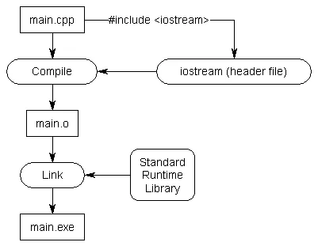
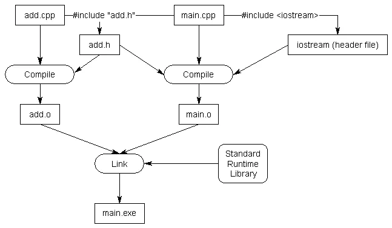

# Header files

## 使用标准库的头文件



## 编写自定义的头文件

add.cpp:

```cpp
int add(int x, int y)
{
    return x + y;
}
```

main.cpp:

```cpp
#include <iostream>

int add(int x, int y); // 前置声明使用函数原型

int main()
{
    std::cout << "The sum of 3 and 4 is " << add(3, 4) << '\n';
    return 0;
}
```

编写头文件非常简单，因为只包含了两部分：

1. _头文件保护符_，下一章将会讨论。
1. 头文件的实际内容，其应该为前置定义的标识符，使得其他文件可以看到。

项目中添加一个头文件类似于添加一个源文件（2.8 的多文件程序将提到）。

头文件经常与代码文件配对，头文件为相关的代码文件提供前置声明。

add.h：

```h
// 1) 真的需要一个头文件保护符在这里，将在下一章讲解，这里现在暂时忽略它

// 2) 这里是 .h 文件的内容，也是声明开始的地方
int add(int x, int y); // 函数原型 add.h -- 不要忘记分号！
```

main.cpp：

```cpp
#include "add.h" // 插入 add.h 的内容到该处。注意这里使用双引号。
#include <iostream>

int main()
{
    std::cout << "The sum of 3 and 4 is " << add(3, 4) << '\n';
    return 0;
}
```

add.cpp：

```cpp
#include "add.h" // 插入 add.h 的内容到该处。注意这里使用双引号。

int add(int x, int y)
{
    return x + y;
}
```

当预处理器处理 `#include "add.h"` 行时，拷贝 add.h 的内容至当前文件的该处。因为 _add.h_ 包含了函数 _add_ 的前置声明，前置声明将会被拷贝到 _main.cpp_。最终的结果是程序的功能与手动添加前置声明在 _main.cpp_ 文件顶部的效果一直。



## 源文件应该包含其配对的头文件

在 C++ 中，代码文件的最佳时间是 `#include` 它们配对的头文件（如果存在的话）。上面的例子中 `add.cpp` 包含了 `add.h`。

## 尖括号 vs 双引号

有可能会好奇为什么 `iostream` 使用的是尖括号，而 `add.h` 使用的是双引号。因为在不同的路径下可能存在相同名称的头文件。两种方式的使用可以帮助预处理器在何处寻找头文件。

当使用尖括号时，则是告诉预处理器该头文件不是由用户编写的。预处理器将会寻找只指定于 `include directories` 路径下的头文件。`include directories` 由用户的项目/IDE 设置/编译器设置配置，通常默认路径中的头文件由用户编译器和/或操作系统所包含。预处理器不会在项目的源代码路径中寻找。

当使用双引号时，则是告诉预处理器头文件是由用户编写的。预处理器将会首先寻找当前路径。如果不能找到匹配的头文件，则会再从 `include directories` 中寻找。

## 头文件可能包含其他的头文件

最佳实践：

每个文件应该显式的 `#include` 所有其需要编译的头文件。不要依赖包含了其他头文件的头文件。

## 头文件的 #include 顺序

最佳实践：

为了最大化编译器发现缺失的 includes，请按照以下顺序进行 #includes：

1. 匹配的头文件
1. 本项目中其他的头文件
1. 第三方库的头文件
1. 标准库的头文件

其中每个组的头文件根据字母顺序进行排序。

这样的话，如果用户自定义的头文件缺失了三方库或者标准库的 #include，则很可能会产生编译错误，因此可以进行修复。

其他的最佳实践：

- 总是包含头文件保护符（详见下一章节）
- 不要在头文件中定义变量以及函数（全局变量除外 -- 之后的章节将会覆盖）
- 头文件和与之关联的源文件拥有一样的名字（例如 _grads.h_ 匹配 _grades.cpp_）
- 每个头文件需要有特定的任务，并且越独立越好。例如用户讲所有关联 A 功能的声明放入 A.h 中，所有关联 B 功能的声明放入 B.h 中。这样用户只需要关心 A 时 include A.h，而不会获得任何关联 B 的事务
- 注意头文件需要显式的在代码文件中 include 所需要的功能
- 所有用户编写的头文件应该可以自身被编译（应该 #include 所有其所需的依赖）
- 仅 #include 所需要的
- 不要 #include .cpp 文件
